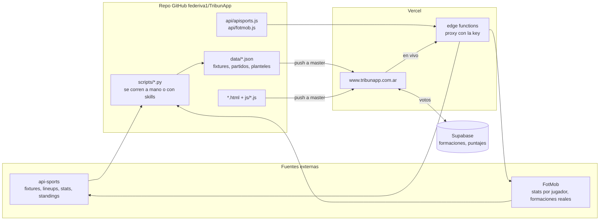

# TribunApp — Documento del proyecto

> Estado al **18 de septiembre de 2026** (Clausura 2026 con la Fecha 9 cerrada; cuartos de
> Libertadores y Sudamericana en juego).
>
> **Qué es cada documento:**
> - **`PROYECTO.md`** (este): la foto completa — objetivos, cómo funciona, procesos, skills,
>   historia, decisiones y pendientes. Para entender el proyecto de punta a punta.
> - **`CLAUDE.md`**: la guía técnica detallada (esquemas, funciones, convenciones de código) que
>   Claude lee en cada sesión. Si algo acá y allá no coincide, manda el código y se corrigen los dos.
> - **`FLUJO.md`**: histórico (describe la etapa con GitHub Actions automáticos). No es el flujo actual.
>
> Ninguno de los tres se publica en la web (`.vercelignore`).

---

## 1. Qué es TribunApp

Una web para **hinchas de los 30 clubes de la Liga Profesional Argentina** (y de los clubes
argentinos en Libertadores y Sudamericana). Producción: **www.tribunapp.com.ar**.

Lo que puede hacer un hincha:

| Antes del partido | Durante | Después |
|---|---|---|
| **Armar su formación** para el próximo partido y votarla en la encuesta de su club | Seguir el **partido en vivo**: marcador, formaciones en cancha y estadísticas | **Puntuar a los jugadores** que jugaron (ventana de 24 h) |
| Ver qué equipos armó la gente | | Ver los **promedios de la gente** y el ranking acumulado |
| Descargar/compartir la placa de su formación | | Ver **estadísticas FotMob** del partido y del torneo, tablas y "tabla xG" |

### Objetivos

1. **Participación**: que el hincha tenga algo para hacer antes (formación) y después (puntajes)
   de cada partido, y que vea lo que votó el resto.
2. **Contenido compartible**: placas descargables, links cortos (`/boca`, `/armar/boca-river`,
   `/puntuar/boca-river`) y placas para redes (@tribunAppFutbol en X).
3. **Datos de calidad**: estadísticas individuales tipo FotMob por partido y acumuladas.
4. **Operación barata y simple**: sitio estático, sin servidores propios. El único costo fijo
   es api-sports (plan Pro). Se opera "a mano" con skills de Claude, desde la compu o desde la nube.
5. **Sin fricción**: no hay login. Cada dispositivo vota como invitado.

### Público y canales

- Web (mobile-first: la mayoría entra desde el celular).
- X: **@tribunAppFutbol** — placas de previa, formaciones confirmadas y final del partido.
  Hoy se publican a mano (no hay credenciales de X cargadas en ningún lado).

---

## 2. Arquitectura e infraestructura

| Pieza | Qué es | Notas |
|---|---|---|
| **Frontend** | HTML + CSS + JS puro, sin framework ni build | Cada página es un archivo; JS compartido en `js/` |
| **Hosting** | **Vercel**, conectado al repo de GitHub | Push a `master` = producción en ~20-60 s. Push a otra rama = *preview* (pide login de Vercel) |
| **Edge functions** | `api/apisports.js`, `api/fotmob.js` | Proxy con la key de api-sports (variable de entorno de Vercel) y passthrough a FotMob (el navegador no llega por CORS) |
| **Repo** | `github.com/federiva1/TribunApp` (público), rama `master` | Fuente de verdad. **Actions deshabilitado** a propósito (ver §11 y §12) |
| **Base de datos** | **Supabase** (plan free) | Tablas `formaciones` y `puntajes`. Se auto-pausa tras ~7 días sin tráfico (ver §13) |
| **api-sports** | API de fútbol, plan **Pro** (7.500 requests/día) | Fixtures, estados, formaciones y eventos en vivo, tablas |
| **FotMob** | Se lee el `__NEXT_DATA__` de sus páginas por HTTP | Fuente de las estadísticas individuales y de las posiciones reales en cancha |
| **Scripts Python** | `scripts/` | Generan/actualizan todo lo de `data/`. Solo librería estándar para el circuito de cierre |

**Configuración de Vercel** (`vercel.json`): 36 rewrites (los 30 alias de club, `/club/copa`,
`/armar/…`, `/puntuar/…` y el proxy) y headers de seguridad (HSTS, X-Frame-Options, nosniff,
Referrer-Policy, Permissions-Policy, CSP). **`.vercelignore`** decide qué NO se publica: la key,
`CLAUDE.md`, `FLUJO.md`, `PROYECTO.md`, `.claude/`, `.github/`, `scripts/`, `*.pyc`, previews de placas.

---

## 3. Mapa del sitio

| Página | URL amigable | Qué muestra |
|---|---|---|
| `index.html` | `/` | Home: tira **EN JUEGO** (partidos en vivo con ficha desplegable), posiciones por zona (Torneo local) y cruces de copas |
| `club.html?c={slug}` | `/boca`, `/river`… · copa: `/boca/sudamericana` | La app de cada club: tiles **Formación**, **Puntajes**, **Estadísticas**, **Est. TribunApp** + ver fechas |
| `puntuar.html` | `/armar/{a}-{b}` · `/puntuar/{a}-{b}` | Landing compartible de un partido: "¿Qué equipo armás?" / "¿A quién puntuás?". El contenido lo decide el estado del partido |
| `fixture.html` | — | Fixture por fecha (liga) y por ronda (copas), con marcador en vivo y pestañas por partido |
| `estadisticas.html?p={id}` | — | Ficha completa de un partido: **Estadísticas / Formaciones / Tabla** |
| `estadisticas-torneo.html` | — | Landing de estadísticas: goleadores/asistidores del torneo + grilla de los 30 clubes |
| `equipo.html?c={slug}&s=estadisticas` | — | Estadísticas del club: tabla FotMob sumada por partidos, filtros, Excel. Con **un solo partido tildado** arma la ficha de ese partido |
| `estadisticas-tribunapp.html` | — | Landing de la comunidad: los 30 clubes con datos de votos |
| `tribunapp-equipo.html?c={slug}` | — | Votos de la gente de un club: formaciones y puntajes por partido real y acumulado |
| `tablas.html` | — | Torneo actual (zonas), Anual, Promedios (descenso) y **Tabla xG** |
| `kits-preview.html` | — | Herramienta interna: los 30 kits de camiseta para revisarlos |

Alias de los 30 clubes: `/river /boca /racing /independiente /sanlorenzo /huracan /velez
/argentinos /platense /tigre /lanus /banfield /union /sarmiento /belgrano /instituto /talleres
/newells /central /centralcordoba /estudiantes /gimnasia /gimnasiamendoza /riestra /barracas
/aldosivi /atleticotucuman /defensa /indrivadavia /erc`.

---

## 4. Cómo funciona cada cosa (para el hincha)

### Formación
- El banco muestra el plantel del club (`data/planteles/{slug}.json`); lesionados/suspendidos
  (`injured` en `js/clubes.js`) van al final del banco.
- Se arma tocando o arrastrando jugadores a la cancha. Con 11 se habilitan **descargar/compartir**
  la placa y **Enviar a encuesta** (un voto por dispositivo y partido).
- **"+ Crear"**: jugador inventado para la placa. Se puede descargar/compartir, pero con un
  inventado en cancha **no** se puede enviar a la encuesta.
- Al enviar: barras con el % de elección de cada jugador + "equipos de la gente".
- Se vota siempre para el **próximo partido** del club.

### Puntajes
- Se abren cuando el partido tiene su ficha procesada y se cierran **24 h después del kickoff**.
- Se puntúa a los que **jugaron** (titulares, suplentes que entraron y DT), 1 a 10. Los suplentes
  pueden ir con **S/P** (sin puntaje), que no cuenta para ningún promedio.
- Extensión manual: `data/puntajes_abiertos.json` (`{"local-visitante": "fecha ISO hasta"}`).
- Resultados: promedio de la gente por jugador. El acumulado ordena con **promedio ajustado estilo
  IMDb** y exige haber sido puntuado en al menos la mitad de los partidos.

### En vivo
- La web consulta `live=all` a api-sports (vía el proxy) cada 60 s y muestra solo **nuestros**
  partidos (los que están en `liga.json` / `copas.json`).
- Ficha en vivo: formaciones en cancha (kit chips, goles, tarjetas, cambios con ▲/▼) y estadísticas.
- Si api-sports no trae formaciones o estadísticas, las completa **FotMob** (`api/fotmob.js`).
- Regla: **una sola fuente por momento** — en vivo api-sports, terminado FotMob.

### Fixture
Por cada partido, según el momento:
- **Antes**: ⓪ *Armá tu formación* → landing `/armar/…` (solo si es el próximo de los dos clubes).
- **Arrancado**: ① *Ficha del partido* y ② *Estadísticas*, desplegables en la misma tarjeta.
- **Terminado (24 h)**: ③ *Puntuar jugadores* → landing `/puntuar/…`. Se retira sola al vencer.

### Estadísticas
- **Del partido** (`estadisticas.html`): stats de equipo, cancha con las formaciones reales y tabla
  de jugadores de los dos equipos.
- **Del club** (`equipo.html`): tabla ancha tipo FotMob que **suma** los partidos tildados, con
  filtros de jugadores y columnas y export a Excel. Si queda **un solo partido** tildado, al segundo
  se arma su ficha (Estadísticas / Formaciones / Tabla); al tildar otro se vuelve a la suma.
- **Est. TribunApp**: lo que votó la gente, agrupado por **partido real** (liga + copas, con
  etiqueta Ida/Vuelta en copa).

### Tablas
- Zonas A y B del torneo actual, Anual y Promedios salen de `standings` de api-sports,
  **corregido** con los partidos terminados que la API todavía no contó (`js/standings-fix.js`).
- Promedios usa totales históricos 2024-2025 fijos (`PROMEDIO_HIST`, **recalcular en 2027**).
- **Tabla xG** ("tabla moral"): cada partido se define por la parte entera del xG de cada equipo.

### Ayuda e idioma
- Íconos de ayuda por sección (`data-help`, `js/ui-help.js`).
- Traducción: se usa el **traductor del navegador** (`lang="es"` + aviso para visitantes que no
  hablan español). No hay i18n propio, a propósito.

---

## 5. Datos

### Identificadores
| Id | Ejemplo | Dónde se usa |
|---|---|---|
| **slug** | `bocajuniors` | Canónico: URLs, archivos, escudos, columna `club` de Supabase |
| **alias** | `boca` | URLs amigables (`URL_ALIAS` en `js/clubes.js`, `ALIAS` en `scripts/clubes_map.py`) |
| **api_id** | `1493103` | Partido en api-sports (`liga.json`, `copas.json`, fichas) |
| **id de ficha** | `rosariocentral-gimnasialp` | `data/partidos/{local}-{visitante}.json` |
| **fotmob_id** | — | Club en FotMob, solo scripts (`clubes_map.py`) |
| **match_date** | `2026-08-29` | Partido en Supabase = **día local AR del kickoff** |

**Regla de oro**: los partidos se ordenan/eligen por **fecha real** (`status.utcTime`), nunca por
número de fecha (las postergaciones rompen el orden).

### Archivos (`data/`)
| Ruta | Contenido | Lo genera |
|---|---|---|
| `fixtures/liga.json` | Los 240 partidos del Clausura (estado, marcador, kickoff) | `fetch_liga_fixtures.py` / `cierre_rapido.py` |
| `fixtures/copas.json` | Ronda actual de Libertadores y Sudamericana | `fetch_copas_fixtures.py` |
| `fixtures/{slug}.json`, `{slug}_{copa}.json` | Fixture por club | `fetch_fixtures.py` (Argentinos es manual) |
| `partidos/index.json` + `partidos/{id}.json` | Ficha de cada partido jugado: goles, formaciones, stats de equipo y por jugador (154 al 18/9) | `cierre_rapido.py`, `fetch_liga_partidos.py`, `cerrar_partido_fotmob.py` |
| `planteles/{slug}.json` | Plantel de cada club (dorsal, nombre, posición) | `fetch_planteles_liga.py` |
| `planteles_overrides.json` | Altas, bajas y dorsales a mano que sobreviven al refresco | a mano |
| `dt_overrides.json` | DT correcto cuando api-sports está atrasado | a mano |
| `puntajes_abiertos.json` | Extensión manual de la ventana de puntajes | a mano |
| `tabla_xg.json` | Tabla xG | `build_tabla_xg.py` |
| `equipos.json` | Los 30 clubes (slug + nombre) | a mano |
| `estadisticas/` | Formato viejo de stats por club (AAAJ y copas) | legacy |
| `mapas/` | Mapas de calor/tiros por jugador (experimental, ninguna página los usa todavía) | `fetch_mapas.py` |
| `social/` | Estado anti-duplicados de placas automáticas; `preview/` = placas generadas (no se commitea) | scripts `social_*` |

Mundial 2026 (terminado, se conserva): `fixtures/mundial.json`, `estado_mundial.json`, fichas de selecciones.

### Supabase
| Tabla | Campos clave | Notas |
|---|---|---|
| `formaciones` | `club, rival, match_date, jugadores, likes, dislikes, device_id` | Un voto por dispositivo y partido (409 = ya votó) |
| `puntajes` | `club, rival, match_date, puntajes` | `puntajes` = `{id_jugador: 1-10 o null (S/P)}`. No tiene `device_id` |

El rol anónimo puede leer, insertar y actualizar (likes), **no borrar**. Datos de prueba se borran
desde el SQL Editor del dashboard.

---

## 6. Código

### Módulos JS compartidos (`js/`)
| Archivo | Qué hace |
|---|---|
| `clubes.js` | Config de los 30 clubes (`CLUBES_CONFIG`), mapas api-sports→slug, alias de URL, lesionados |
| `kits.js` | Kits de camiseta (kit chips) — fuente única |
| `club-colors.js` | Color de identidad de cada club (sacado del escudo) |
| `ficha-cancha.js` | Dibuja la cancha con las dos formaciones y el bloque de estadísticas (`fcCanchaHTML`, `fcStatsHTML`) |
| `match-live.js` | Arma la ficha en vivo desde api-sports (+ fallback FotMob) con el mismo formato que `data/partidos` |
| `standings-fix.js` | Completa la tabla con los partidos que api-sports todavía no contó |
| `partido-card.js` | Widget viejo de partido en vivo — **sin uso** (ninguna página lo carga) |
| `ui-help.js` | Tooltips de ayuda y aviso de traducción |
| `config.js` | URL y key pública (anon) de Supabase |
| `auth.js`, `auth-ui.js` | Login viejo, **sin uso** (la app es solo invitado) |

### Scripts (`scripts/`)
| Grupo | Scripts |
|---|---|
| **Cierre de partidos** | `cierre_rapido.py` (el principal), `fetch_liga_partidos.py`, `cerrar_partido_fotmob.py` (si api-sports está caído), `build_tabla_xg.py` |
| **Fixtures** | `fetch_liga_fixtures.py`, `fetch_copas_fixtures.py`, `fetch_fixtures.py`, `fetch_proximos_partidos.py`, `fetch_escudos_copa.py` |
| **FotMob / stats** | `scrape_fotmob_mundial.py` (motor del enrich), `backfill_formaciones.py`, `fetch_mapas.py`, `fetch_match_stats.py` + `scrape_fotmob_partidos.py` (formato viejo) |
| **Planteles** | `fetch_planteles_liga.py`, `backfill_plantel_nums.py`, `scraper_planteles.py` (legacy) |
| **Placas** | `social_fecha.py`, `social_club.py`, `social_xi_cruce.py`, `social_resultado.py`, `social_lineups.py`, `social_comparativa.py` |
| **Datos / utilidades** | `check_datos.py` (red de seguridad), `exportar_datos.py`, `clubes_map.py`, `apikey.py`, `extract_club_colors.py` |
| **Mundial / one-shots** | `fetch_mundial_*.py`, `scraper_mundial.py`, `scraper_dt_mundial.py`, `excel_to_json.py`, `migrar_votos_formaaajcion.py` (**no volver a correr con `--execute`**) |

---

## 7. Procesos

### 7.1 Publicar
**Publicar = que el cambio llegue a `master`.** Vercel lo pone en producción solo.

| Tipo de cambio | Cómo |
|---|---|
| **Datos** (cierre de partido, fixtures, planteles) | Desde la compu: `python scripts/check_datos.py` → commit `data: …` → `git push origin master` |
| **Código o docs** | Rama → PR → mirar el preview de Vercel → OK de Fede → squash-merge |
| **Desde una sesión en la nube** | La nube solo puede pushear a su rama `claude/…`: todo va por PR + squash-merge |

- `check_datos.py` es **obligatorio** antes de commitear datos: falla si un fixture pierde
  partidos, si `liga.json` "des-termina" un resultado, si se borra una ficha o si un JSON quedó roto.
- Empezar siempre con `git pull --rebase origin master`. Nunca `--force` a `master`.
- Volver atrás: `git revert <sha>` + push, o *Instant Rollback* desde el panel de Vercel.
- Verificar en producción con `curl` (el dato nuevo aparece en 20-60 s).

### 7.2 Ciclo de una fecha
| Momento | Qué se hace | Cómo |
|---|---|---|
| **Días antes** | Refrescar fixtures (postergaciones, horarios) | `/actualizar-fecha` (parte B) |
| **Día del partido** | Placa "partidos de hoy" | `/placas` → `social_fecha.py` |
| **~30 min antes** | Placa de formaciones confirmadas (los 22 en una cancha) | `/placas` → `social_xi_cruce.py` (si api-sports no las tiene, desde capturas de los clubes) |
| **En juego** | Nada: el vivo es automático (proxy + FotMob de respaldo) | — |
| **Al final** | **Cerrar el partido**: FT en `liga.json`, ficha en `data/partidos`, tabla xG, link `/puntuar/…` | "cerrá X" → `/actualizar-fecha` (parte A) + publicar |
| **Al final** | Placa "final del partido" | `/placas` → `social_resultado.py --test-partido {id}` |
| **24 h después** | Los puntajes se cierran solos | — |
| **Cada 1-3 fechas** | Planteles (altas, bajas, dorsales) | `/actualizar-planteles` |

Detalles del cierre:
- `cierre_rapido.py --check` dice si hay candidatos (partidos que arrancaron hace 100-210 min).
- Pasadas 3,5 h del kickoff: `fetch_liga_partidos.py --torneo clausura --date YYYY-MM-DD` + `fetch_liga_fixtures.py`.
- api-sports caído: `cerrar_partido_fotmob.py --api-id <id>`.
- Copas: las toma el mismo `cierre_rapido`; después `fetch_copas_fixtures.py`.

### 7.3 Cambios de código
1. Worktree nuevo (`.claude/worktrees/<nombre>`) con una rama desde `origin/master`.
2. Cambiar, chequear sintaxis (`node --check` de los `<script>`), probar en el navegador de la app
   con un server local sobre el worktree (config temporal en `.claude/launch.json`).
3. Commit, push de la rama, PR con descripción y qué mirar en el preview.
4. Fede mira el preview (pide login de Vercel) y da el OK → squash-merge → verificar producción.
5. Borrar la rama. (OneDrive a veces no deja borrar la carpeta del worktree: se borra a mano.)

### 7.4 Correcciones manuales frecuentes
| Problema | Solución |
|---|---|
| Nombre mal escrito por FotMob ("Silveor") | Corregir a mano en las fichas afectadas (un reproceso con `--force` lo reintroduce) |
| DT viejo en api-sports | `data/dt_overrides.json` |
| Alta/baja/dorsal de un jugador | `data/planteles/{slug}.json` **y** `data/planteles_overrides.json` |
| Lesionado / suspendido | `injured: ['dorsal']` en `js/clubes.js` |
| Reabrir puntajes fuera de la ventana | `data/puntajes_abiertos.json` (borrar la entrada cuando vence) |
| `liga.json` sin el FT (lag de api-sports) | Lo repara solo `reparar_estados()` con la ficha del partido |
| Stats de equipo congeladas por api-sports | El pipeline las reemplaza con las de FotMob si detecta el snapshot |

---

## 8. Skills de Claude

Viven en `.claude/skills/` del repo y se invocan con `/nombre` o pidiéndolo en palabras.

| Skill | Cuándo | Qué hace |
|---|---|---|
| **`/actualizar-fecha`** | "cerrá X", "terminó el partido", "publicá", "refrescá el fixture" | Cierre de partidos, refresco de fixtures, `check_datos`, commit y push a `master`, verificación. Incluye la variante para la nube |
| **`/placas`** | "haceme la placa", "la previa", "las formaciones", capturas de los 11 | Placas de previa, formaciones confirmadas y final del partido en `data/social/preview/` (no publica nada) |
| **`/actualizar-planteles`** | "actualizá los planteles", altas/bajas | Planteles de los 30 clubes desde FotMob + dorsales desde api-sports, respetando los overrides |
| **`/exportar-datos`** | "exportá los datos", "pasame los CSV" | CSV de partidos, equipos y jugadores + README del esquema |

---

## 9. Entornos de trabajo

### Compu de Fede (Windows)
- Repo: `C:\Users\feder\OneDrive\Escritorio\TribunApp` (`master` alineado con GitHub).
- Key de api-sports: `scripts/.apikey` (en `.gitignore`, nunca se commitea).
- `gh` (GitHub CLI) logueado como `federiva1`.
- Preview local: config `sitio` de `.claude/launch.json` (puerto 3031). El proxy `/api/apisports`
  y las URLs amigables **no** existen en local (probar con `club.html?c=…` o en un preview de Vercel).
- Carpeta vieja `Escritorio\tribunapp-deploy\tribunappdeploy`: fue producción durante la suspensión
  de GitHub. **Respaldo congelado: no publicar más desde ahí.**

### Sesiones en la nube (claude.ai/code, app del celular)
Configuración del entorno (ícono de nube → engranaje):
- **Red**: *Custom* + "include default list", con `v3.football.api-sports.io`, `www.fotmob.com`,
  `www.tribunapp.com.ar`. Con la red por defecto los scripts no llegan a esas APIs.
- **Key**: recomendada como *API credential* (header `x-apisports-key`, sin prefijo, sitio
  `v3.football.api-sports.io`) + variable `API_SPORTS_VIA_PROXY=1`: la key nunca entra a la sesión.
  Alternativa: variable `API_SPORTS_KEY`.
- Publicar desde la nube = PR + squash-merge (no puede pushear a `master`).

### Vercel
- Producción: `www.tribunapp.com.ar` (cada commit de `master`).
- Previews: una URL por deploy y una fija por rama: `tribunapp-git-{rama}-formaaajcions-projects.vercel.app`.

---

## 10. Ramas

| Rama | Para qué | Estado |
|---|---|---|
| `master` | Producción | Fuente de verdad |
| `pizarra` | **Pizarra táctica** (`pizarra.html`: dibujar jugadas, animar por fotogramas, grabar video con micrófono y subtítulos) + botón en el header | En pruebas, no está en producción. Se actualiza mergeándole `master` |
| `video` | **Demo para un video promocional**: Rosario Central-Gimnasia simulado en vivo + puntajes abiertos (el envío no se guarda) | **Nunca mergear.** Borrar cuando esté el video |
| `respaldo/local-2026-09-18` | Solo local: lo que la compu tenía sin commitear antes de alinearse con GitHub | No se pushea |
| Otras viejas (`claude/…`, `feature/…`, `stats`, `test`) | Ya contenidas en `master` salvo 2 con un commit suelto | Pendiente de limpieza |

---

## 11. Seguridad y reglas de trabajo

- **La key de api-sports nunca va a un commit** ni a la web: `scripts/.apikey` (gitignored), variable
  de entorno de Vercel para el proxy, *API credential* en la nube. El repo es **público**.
- **`.vercelignore`** mantiene fuera de la web los archivos internos (verificado: dan 404).
- El proxy `api/apisports.js` solo permite `fixtures`, `standings`, `teams`, `players`, con control de origen.
- **Confirmaciones**: todo lo que escribe en GitHub o Vercel (mergear un PR, tocar Actions o la
  config de Vercel) se hace con el OK de Fede. Excepción: los commits de datos que él pide
  explícitamente ("cerrá X", "publicá").
- **GitHub Actions apagado** y los 5 crons comentados (ver §12). No reactivarlos como estaban.
- **No abrir otra cuenta de GitHub** (sería evadir una sanción).

---

## 12. Historia y decisiones

| Cuándo | Qué pasó |
|---|---|
| Antes | **Formaaajcion**, app de Argentinos Juniors (formación + puntajes): la base de código |
| **15/4/2026** | **Lanzamiento de TribunApp**: los 30 clubes con un único `club.html?c=slug` y una sola base Supabase |
| Abr-May 2026 | Estadísticas por partido (FotMob) y votos migrados de Formaaajcion |
| Abr-Jul 2026 | Login con Supabase Auth / Google: se ocultó el 10/6 y se sacó del club el 25/7 → la app queda **solo invitado** |
| Jun-Jul 2026 | **Módulo Mundial 2026** (fixture, bracket, puntajes por selección). Varias páginas quedaron reutilizadas para la liga |
| Jul 2026 | Ficha en vivo (`match-live.js`), kits por club, colores del escudo, fixture con estadísticas |
| Ago 2026 | Clausura: cierre rápido de partidos, placas automáticas, fallback FotMob en vivo, tabla xG, URLs amigables, pizarra táctica (rama aparte) |
| **31/8 – 18/9** | **Cuenta de GitHub suspendida** (un sistema automático de detección de abuso; la hipótesis es el volumen de los crons: ~600 corridas/día de scraping + auto-commit). Se trabajó desde una carpeta local publicando con Vercel CLI |
| Esa etapa | Landing `/armar` y `/puntuar`, pestañas del fixture, "+ Crear", equipos de la gente, agrupado por partido real en Est. TribunApp, colores de copa, reapertura manual de puntajes |
| **18/9** | Cuenta recuperada. PR #137 vuelca producción al repo; **Actions queda apagado**, crons comentados. Desde ahí se publica con push a `master` |
| 18/9 | PR #138 (`check_datos` en Windows, key de api-sports para la nube, `.vercelignore` de `scripts/` y `.github/`); PR #139 (ficha de un partido dentro de las estadísticas del club); rama `video` |

**Decisiones de diseño que conviene no revertir sin pensarlo:**
- **Sin login**: la identidad es un UUID por dispositivo. Menos fricción; el costo es que no hay
  deduplicación fuerte de puntajes.
- **Traductor del navegador** en vez de i18n propio: mantener cientos de textos en varios idiomas no
  pagaba. Si se pide traducción "de marca", se encara página por página.
- **FotMob para estadísticas, api-sports para estados y en vivo**: FotMob trae stats individuales mucho
  más ricas; api-sports marca el FT al instante por id.
- **Datos estáticos en el repo** (no en una base): el sitio sirve JSON versionado, cada cambio queda en
  git y se puede revertir. La base solo guarda lo que genera la gente.
- **Operación manual con skills** en lugar de crons: después de la suspensión, cualquier automatización
  nueva tiene que ser de baja frecuencia y decidida por Fede.

---

## 13. Problemas conocidos y cómo reconocerlos

| Síntoma | Causa | Qué hacer |
|---|---|---|
| "Error de conexión" / `Failed to fetch` / 503 al votar | **Supabase pausado** (plan free, ~7 días sin tráfico). No es un problema de permisos | Dashboard de Supabase → *Resume project* (1-3 min) |
| Partido terminado que sigue "en juego" o sin FT en `liga.json` | Los endpoints agregados de api-sports tardan en marcar el FT | `reparar_estados()` lo corrige con la ficha; si no, `fetch_liga_partidos --date` |
| Formaciones "aún no confirmadas" en pleno partido | api-sports sin lineups | El fallback FotMob las completa solo |
| Ficha sin stats individuales | FotMob todavía no publicó `playerStats` | Se auto-repara reprocesando más tarde (`fetch_liga_partidos.py`) |
| Placa sin escudo en iPhone en `/club/copa` | html2canvas en Safari pierde el `<base>` | Toda imagen de placa pasa por `_shAbs()` |
| El vivo no refresca en una pestaña de fondo | La página pausa el poll con la pestaña oculta (a propósito) | Traer la pestaña al frente |
| Preview de Vercel da 302 | Deployment Protection (login) | Abrirlo con la sesión de Vercel |
| `check_datos.py` u otro script falla con `UnicodeEncodeError` en Windows | Consola en cp1252 | Ya corregido en `check_datos`; en otros, `PYTHONIOENCODING=utf-8` |
| No se puede borrar la carpeta de un worktree | OneDrive la tiene tomada | Borrarla a mano más tarde |

---

## 14. Pendientes

- **Supabase**: evitar la auto-pausa (keep-alive liviano o plan Pro).
- **Automatización**: si se quiere volver a automatizar cierres o placas, con intervalos largos y fuera
  de GitHub Actions (por ejemplo rutinas de Claude en la nube). Decisión de Fede.
- **Probar el modo "API credential"** de la key en la primera sesión en la nube.
- **Promedios 2027**: recalcular `PROMEDIO_HIST` en `tablas.html`.
- **Escudos de rivales extranjeros** en el marcador de la ficha del partido (tomarlos de `copas.json`).
- **Nombres de FotMob mal escritos**: evaluar un `data/nombres_overrides.json` para que sobrevivan a reprocesos.
- **Limpieza**: ramas viejas del remoto, carpetas de worktrees en `.claude/worktrees/`, rama `video`
  cuando esté el video.
- **Pizarra táctica**: definir si pasa a producción.
- **`FLUJO.md`**: reescribirlo o archivarlo (hoy es histórico).

---

## 15. Glosario

| Término | Significado |
|---|---|
| **Ficha** | Archivo `data/partidos/{id}.json` de un partido (o su vista en la web) |
| **Cerrar un partido** | Marcar el FT, generar la ficha, recalcular la tabla xG y publicar: abre los puntajes |
| **Placa** | Imagen para compartir (formación, puntajes, previa, final) |
| **Kit chip** | Circulito con el diseño de la camiseta del club y el dorsal |
| **Gate** | Regla que abre/cierra formación o puntajes |
| **S/P** | Sin puntaje (suplente que casi no jugó); no cuenta para promedios |
| **Tabla xG / tabla moral** | Tabla donde cada partido se define por el xG de cada equipo |
| **Preview** | Deploy de Vercel de una rama que no es `master` (pide login) |
| **Worktree** | Copia de trabajo aparte del repo para una rama, en `.claude/worktrees/` |
| **FT** | *Full time*: partido terminado |
